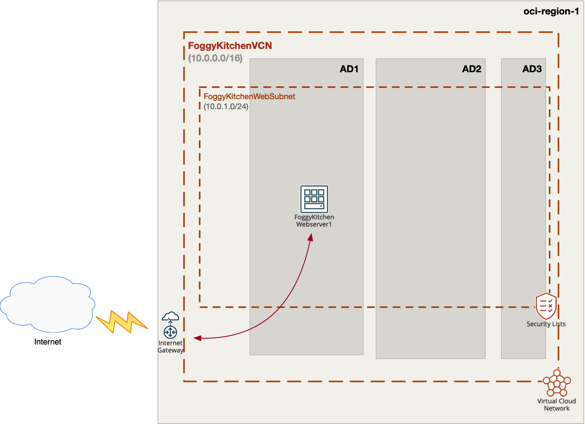

# FoggyKitchen Terraform OCI Course

## LESSON 1 - Single Webserver

In this lesson we will create the simplest set of OCI resources, starting with one compartment, one VCN and one subnet in this VCN. The subnet will be regional (covering all availability domains AD1-AD3). Inside this public subnet, we will nest one VM for WebServer. Public subnet means that VM will have public IP associated - VM will be exposed to the public Internet (via Internet Gateway and proper route table). After this deployment, one basic Security List will permit access from the public Internet to VM via protocol SSH (port 22) & HTTP/HTTPS protocols (port 80, 443). For the software provisioning we will utilize null_resource and remote-exec capability of Terraform *Null Provider* - Terraform will install HTTP server with root webpage content. As a consequence, after successful terraform apply, we should be able to visit VM public IP address with our web browser and expect their simple webpage content - **Welcome to FoggyKitchen.com! This is WEBSERVER1...**.



## Deploy Using Oracle Resource Manager

1. Click [](https://cloud.oracle.com/resourcemanager/stacks/create?region=home&zipUrl=https://github.com/mlinxfeld/foggykitchen_tf_oci_course/releases/latest/download/LESSON1_single_webserver.zip)

    If you aren't already signed in, when prompted, enter the tenancy and user credentials.

2. Review and accept the terms and conditions.

3. Select the region where you want to deploy the stack.

4. Follow the on-screen prompts and instructions to create the stack.

5. After creating the stack, click **Terraform Actions**, and select **Plan**.

6. Wait for the job to be completed, and review the plan.

    To make any changes, return to the Stack Details page, click **Edit Stack**, and make the required changes. Then, run the **Plan** action again.

7. If no further changes are necessary, return to the Stack Details page, click **Terraform Actions**, and select **Apply**. 

## Deploy Using the Terraform CLI

### Clone of the repo
Now, you'll want a local copy of this repo. You can make that with the commands:

Clone the repo from github by executing the command as follows and then go to proper subdirectory:

```
Martin-MacBook-Pro:~ martinlinxfeld$ git clone https://github.com/mlinxfeld/foggykitchen_tf_oci_course.git

Martin-MacBook-Pro:~ martinlinxfeld$ cd foggykitchen_tf_oci_course/

Martin-MacBook-Pro:foggykitchen_tf_oci_course martinlinxfeld$ cd LESSON1_single_webserver

```

### Prerequisites
Create environment file with TF_VARs:

```
Martin-MacBook-Pro:LESSON1_single_webserver martinlinxfeld$ vi setup_oci_tf_vars.sh

export TF_VAR_user_ocid="ocid1.user.oc1..aaaaaaaaob4qbf2(...)uunizjie4his4vgh3jx5jxa"
export TF_VAR_tenancy_ocid="ocid1.tenancy.oc1..aaaaaaaas(...)krj2s3gdbz7d2heqzzxn7pe64ksbia"
export TF_VAR_compartment_ocid="ocid1.tenancy.oc1..aaaaaaaasbktyckn(...)ldkrj2s3gdbz7d2heqzzxn7pe64ksbia"
export TF_VAR_fingerprint="00:f9:d1:41:bb:57(...)82:47:e6:00"
export TF_VAR_private_key_path="/tmp/oci_api_key.pem"
export TF_VAR_availablity_domain_name="unja:EU-FRANKFURT-1-AD-1"
export TF_VAR_region="eu-frankfurt-1"

Martin-MacBook-Pro:LESSON1_single_webserver martinlinxfeld$ source setup_oci_tf_vars.sh
```

### Create the Resources
Run the following commands:

```
Martin-MacBook-Pro:LESSON1_single_webserver martinlinxfeld$ terraform init
    
Martin-MacBook-Pro:LESSON1_single_webserver martinlinxfeld$ terraform plan

Martin-MacBook-Pro:LESSON1_single_webserver martinlinxfeld$ terraform apply
```

### Destroy the Deployment
When you no longer need the deployment, you can run this command to destroy the resources:

```
Martin-MacBook-Pro:LESSON1_single_webserver martinlinxfeld$ terraform destroy
```
