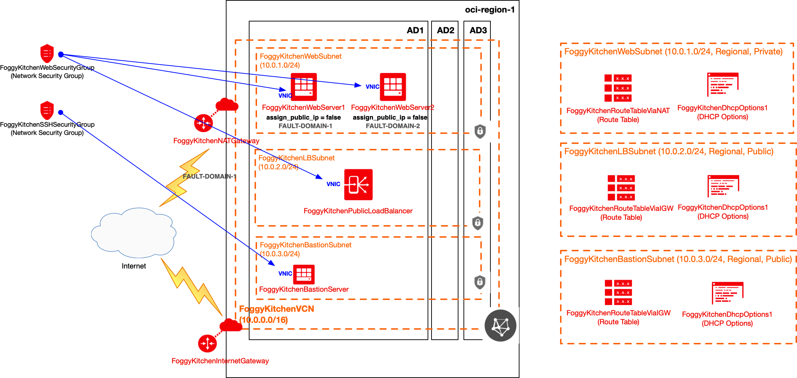

# FoggyKitchen Terraform OCI Course

## LESSON 4a - Load Balancer + NAT Gateway + Bastion Host (+ Network Security Groups) 

In this lesson, we will explore a new approach to security in OCI. Instead of using Security Lists which were previously bound to subnet level, this time we will create Network Security Groups (NGS) with Network Security Roles. Each NGS will be then bound to each VM's virtual network interface (VNIC) and Load Balancer directly (not via LB subnet). It makes OCI security more granular. This is an optional lesson, just to explore new security concepts in OCI. Keep in mind that further lessons will be fully based on the previously implemented Security List concept. 



## Deploy Using Oracle Resource Manager

1. Click [](https://cloud.oracle.com/resourcemanager/stacks/create?region=home&zipUrl=https://github.com/mlinxfeld/foggykitchen_tf_oci_course/releases/latest/download/LESSON4a_load_balancer_NAT_bastion_security_groups.zip)

    If you aren't already signed in, when prompted, enter the tenancy and user credentials.

2. Review and accept the terms and conditions.

3. Select the region where you want to deploy the stack.

4. Follow the on-screen prompts and instructions to create the stack.

5. After creating the stack, click **Terraform Actions**, and select **Plan**.

6. Wait for the job to be completed, and review the plan.

    To make any changes, return to the Stack Details page, click **Edit Stack**, and make the required changes. Then, run the **Plan** action again.

7. If no further changes are necessary, return to the Stack Details page, click **Terraform Actions**, and select **Apply**. 

## Deploy Using the Terraform CLI

### Clone of the repo
Now, you'll want a local copy of this repo. You can make that with the commands:

Clone the repo from github by executing the command as follows and then go to proper subdirectory:

```
Martin-MacBook-Pro:~ martinlinxfeld$ git clone https://github.com/mlinxfeld/foggykitchen_tf_oci_course.git

Martin-MacBook-Pro:~ martinlinxfeld$ cd foggykitchen_tf_oci_course/

Martin-MacBook-Pro:foggykitchen_tf_oci_course martinlinxfeld$ cd LESSON4a_load_balancer_NAT_bastion_security_groups

```

### Prerequisites
Create environment file with TF_VARs:

```
Martin-MacBook-Pro:LESSON4a_load_balancer_NAT_bastion_security_groups martinlinxfeld$ vi setup_oci_tf_vars.sh

export TF_VAR_user_ocid="ocid1.user.oc1..aaaaaaaaob4qbf2(...)uunizjie4his4vgh3jx5jxa"
export TF_VAR_tenancy_ocid="ocid1.tenancy.oc1..aaaaaaaas(...)krj2s3gdbz7d2heqzzxn7pe64ksbia"
export TF_VAR_compartment_ocid="ocid1.tenancy.oc1..aaaaaaaasbktyckn(...)ldkrj2s3gdbz7d2heqzzxn7pe64ksbia"
export TF_VAR_fingerprint="00:f9:d1:41:bb:57(...)82:47:e6:00"
export TF_VAR_private_key_path="/tmp/oci_api_key.pem"
export TF_VAR_region="eu-amsterdam-1"

Martin-MacBook-Pro:LESSON4a_load_balancer_NAT_bastion_security_groups martinlinxfeld$ source setup_oci_tf_vars.sh
```

### Create the Resources
Run the following commands:

```
Martin-MacBook-Pro:LESSON4a_load_balancer_NAT_bastion_security_groups martinlinxfeld$ terraform init
    
Martin-MacBook-Pro:LESSON4a_load_balancer_NAT_bastion_security_groups martinlinxfeld$ terraform plan

Martin-MacBook-Pro:LESSON4a_load_balancer_NAT_bastion_security_groups martinlinxfeld$ terraform apply
```

### Destroy the Deployment
When you no longer need the deployment, you can run this command to destroy the resources:

```
Martin-MacBook-Pro:LESSON4a_load_balancer_NAT_bastion_security_groups martinlinxfeld$ terraform destroy
```
