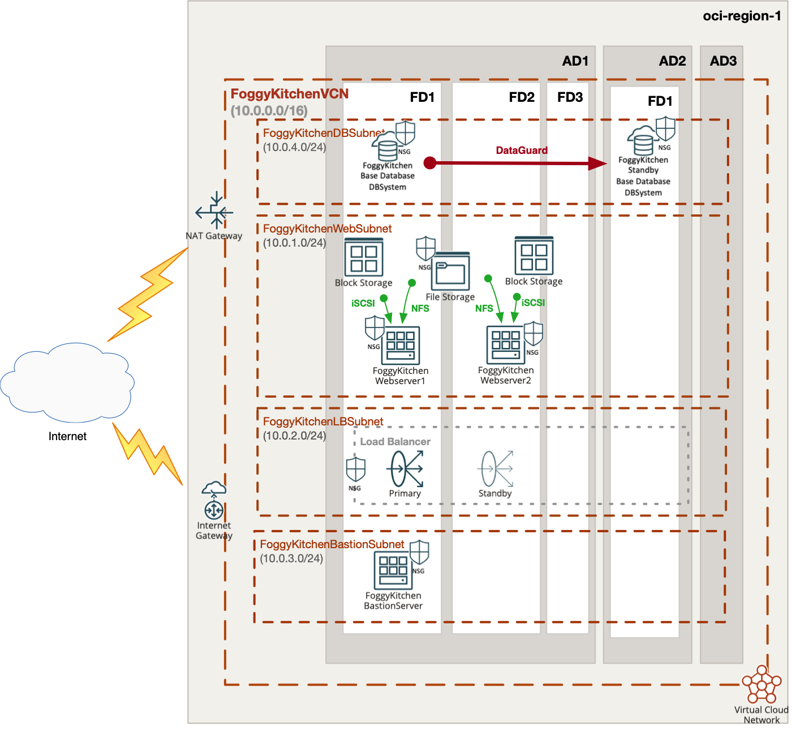

# FoggyKitchen Terraform OCI Course

## LESSON 7a - DBSystem with DataGuard

In this lesson, we will introduce the OCI DBSystem DataGuard association. It will provide standby database in additional DBSystem located in a different AD comparing to primary database. This setup is for DR purposes.
Another aspect is a switch from security lists to NSG, now also on DBSystem level.



---

## Authentication Methods for Terraform and OpenTofu

Before deploying the resources, you need to configure authentication with OCI. You can choose between two methods:

### **Option 1: Environment Variables**

1. **Use the Example File**  
   The repository includes a `setup_oci_tf_vars.sh.example` file. Copy it to create your own environment variable setup file:

   ```bash
   cp setup_oci_tf_vars.sh.example setup_oci_tf_vars.sh
   ```

2. **Edit the File**  
   Open `setup_oci_tf_vars.sh` and update the placeholders with your OCI credentials:

   ```bash
   export TF_VAR_user_ocid="ocid1.user.oc1..*******"
   export TF_VAR_tenancy_ocid="ocid1.tenancy.oc1..*******"
   export TF_VAR_compartment_ocid="ocid1.compartment.oc1..*******"
   export TF_VAR_fingerprint="xx:xx:xx:*******:xx:xx"
   export TF_VAR_private_key_path="/Users/MyUser/.oci/oci_api_key.pem"
   export TF_VAR_region="eu-frankfurt-1"
   ```

3. **Activate the Variables**  
   Run the following command to load the environment variables into your session:

   ```bash
   source setup_oci_tf_vars.sh
   ```

---

### **Option 2: `terraform.tfvars` File**

1. **Use the Example File**  
   The repository includes a `terraform.tfvars.example` file. Copy it to create your own `terraform.tfvars` file:

   ```bash
   cp terraform.tfvars.example terraform.tfvars
   ```

2. **Edit the File**  
   Open `terraform.tfvars` and replace the placeholder values with your actual OCI credentials:

   ```hcl
   tenancy_ocid            = "ocid1.tenancy.oc1..*******"
   user_ocid               = "ocid1.user.oc1..*******"
   fingerprint             = "xx:xx:xx:*******:xx:xx"
   private_key_path        = "/Users/MyUser/.oci/oci_api_key.pem"
   region                  = "eu-frankfurt-1"
   compartment_ocid        = "ocid1.compartment.oc1..*******"
   ```

---

## Deploy Using Terraform or OpenTofu

### **1. Clone the Repository**

First, clone the repository to your local machine and navigate to the appropriate directory:

```bash
git clone https://github.com/mlinxfeld/foggykitchen_tf_oci_course.git
cd foggykitchen_tf_oci_course/
cd LESSON7a_dbsystem_with_dataguard
```

---

### **2. Initialize the Project**

Run the following command to initialize Terraform or OpenTofu. This will download the necessary providers and modules:

For Terraform:
```bash
terraform init
```

For OpenTofu:
```bash
tofu init
```

---

### **3. Plan the Deployment**

Run the `plan` command to preview the changes that Terraform or OpenTofu will make:

For Terraform:
```bash
terraform plan
```

For OpenTofu:
```bash
tofu plan
```

---

### **4. Apply the Changes**

To create the resources in OCI, run the `apply` command. You will be prompted to confirm:

For Terraform:
```bash
terraform apply
```

For OpenTofu:
```bash
tofu apply
```

---

### **5. Destroy the Deployment**

When you no longer need the resources, use the `destroy` command to clean up:

For Terraform:
```bash
terraform destroy
```

For OpenTofu:
```bash
tofu destroy
```

---

## Deploy Using Oracle Resource Manager

1. Click [](https://cloud.oracle.com/resourcemanager/stacks/create?region=home&zipUrl=https://github.com/mlinxfeld/foggykitchen_tf_oci_course/releases/latest/download/LESSON7a_dbsystem_with_dataguard.zip)

    If you aren't already signed in, when prompted, enter the tenancy and user credentials.

2. Review and accept the terms and conditions.

3. Select the region where you want to deploy the stack.

4. Follow the on-screen prompts and instructions to create the stack.

5. After creating the stack, click **Terraform Actions**, and select **Plan**.

6. Wait for the job to be completed, and review the plan.

    To make any changes, return to the Stack Details page, click **Edit Stack**, and make the required changes. Then, run the **Plan** action again.

7. If no further changes are necessary, return to the Stack Details page, click **Terraform Actions**, and select **Apply**.

## Contributing
This project is open source. Please submit your contributions by forking this repository and submitting a pull request! [FoggyKitchen.com](https://foggykitchen.com/) appreciates any contributions that are made by the open source community.

## License
Copyright (c) 2025 [FoggyKitchen.com](https://foggykitchen.com/)

Licensed under the Universal Permissive License (UPL), Version 1.0.

See [LICENSE](LICENSE) for more details.