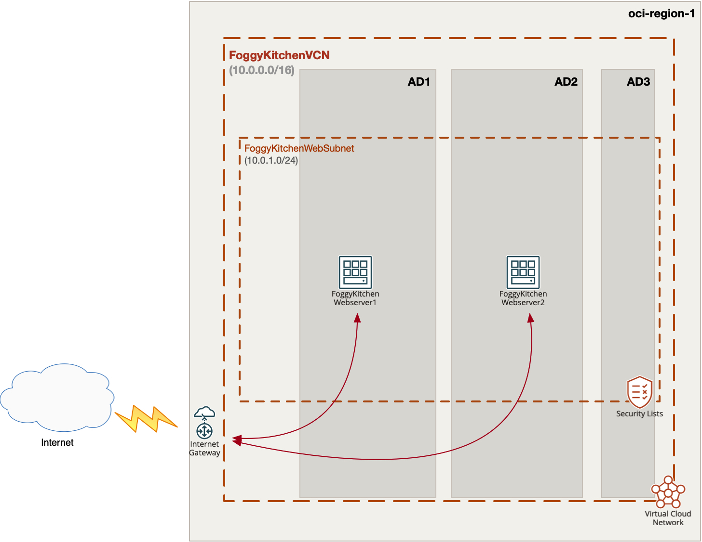
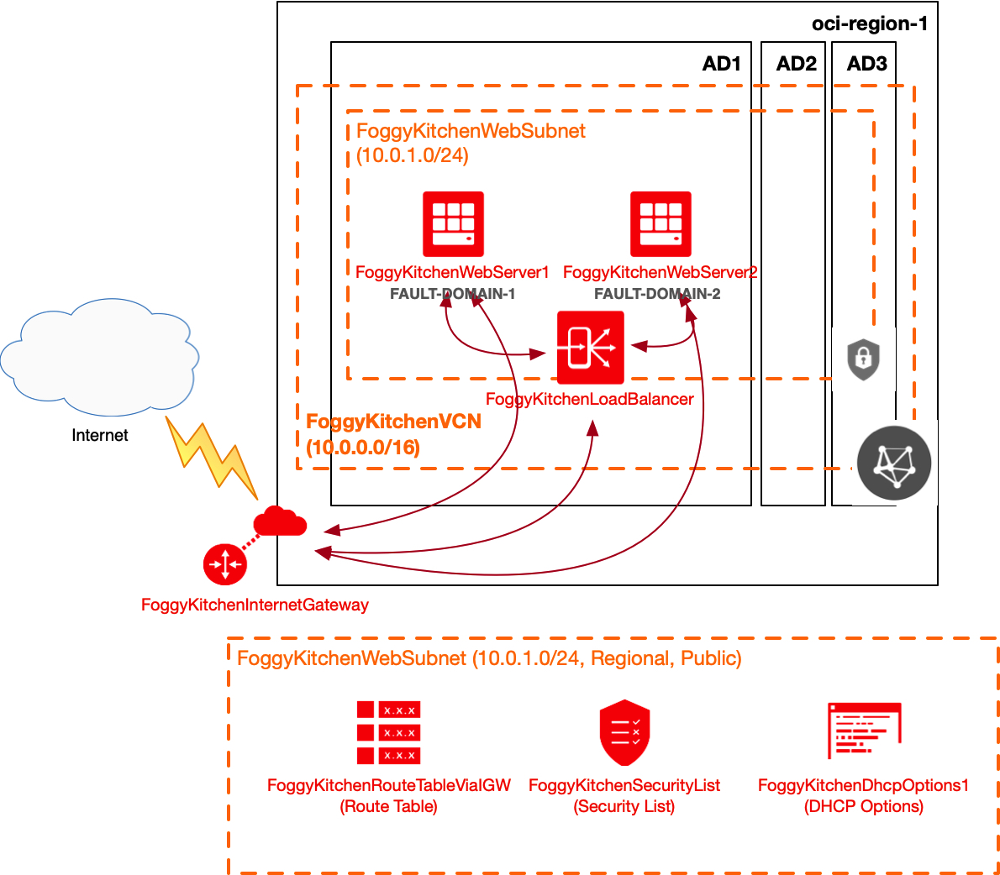
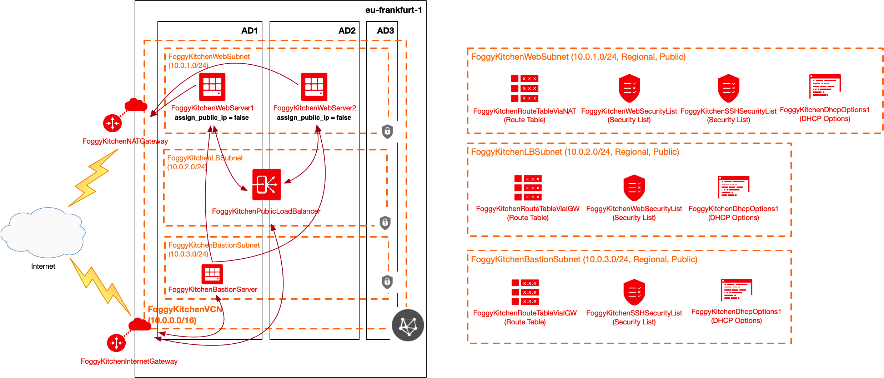
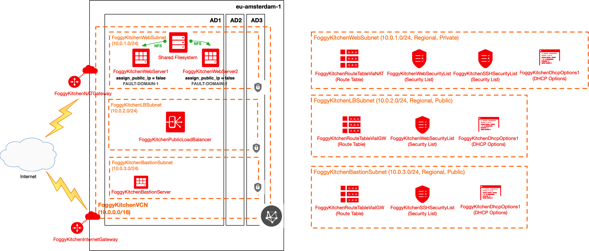
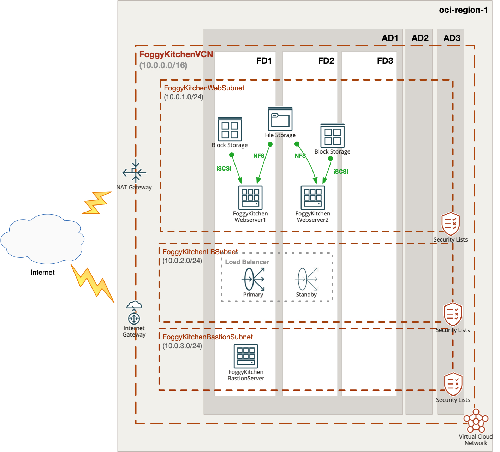
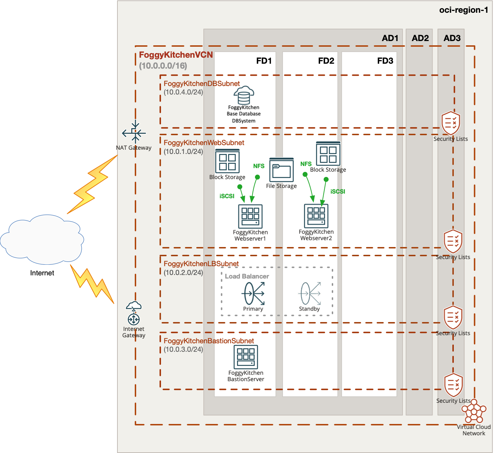
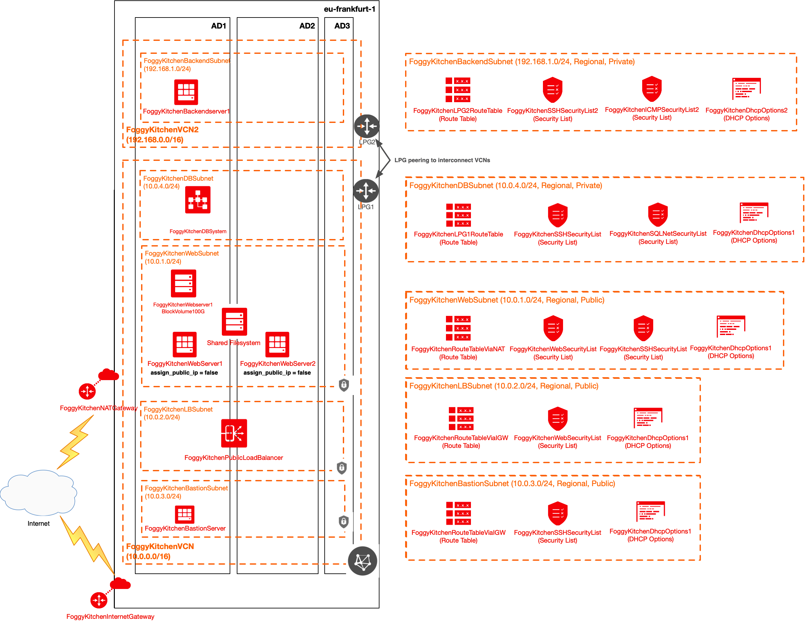

# FoggyKitchen Terraform OCI Course

## Course description

In this course you can find 8 lessons with the Terraform's HCL version 0.12 code examples for deployment of OCI resources. Our course starts with the simple example of one webserver in one regional public subnet, nested in one VCN in particular availability domain (AD). Incrementally next lessons will show you how to implement multiplied webservers, spread between ADs, located under load balancer umbrella. Further we will make this setup even more secure by introduction of private subnets and bastion host to jump over. We will also explore storage options for the servers (local block volumes and shared filesystems). Besides of the web tier we will introduce VM based OCI DBSystem deployed in the fully separated private subnet. Last lesson will introduce VCN local peering for integration of private DBSystem and external VCN with backend server (local VCN peering).  

## How to use code from the lessons

### STEP 1.

Clone the repo from github by executing the command as follows and then go to foggykitchen_tf_oci_course directory:

```
Martin-MacBook-Pro:~ martinlinxfeld$ git clone https://github.com/mlinxfeld/foggykitchen_tf_oci_course.git
Cloning into 'foggykitchen_tf_oci_course'...
remote: Enumerating objects: 121, done.
remote: Counting objects: 100% (121/121), done.
remote: Compressing objects: 100% (89/89), done.
remote: Total 258 (delta 73), reused 79 (delta 32), pack-reused 137
Receiving objects: 100% (258/258), 68.71 MiB | 23.28 MiB/s, done.
Resolving deltas: 100% (142/142), done.

Martin-MacBook-Pro:~ martinlinxfeld$ cd foggykitchen_tf_oci_course/
Martin-MacBook-Pro:foggykitchen_tf_oci_course martinlinxfeld$ ls -latr
total 16
drwxr-xr-x   7 martinlinxfeld  staff   224  9 gru 17:47 ..
drwxr-xr-x  14 martinlinxfeld  staff   448  9 gru 17:47 LESSON1_single_webserver
drwxr-xr-x  16 martinlinxfeld  staff   512  9 gru 17:47 LESSON2_second_webserver_in_other_AD
drwxr-xr-x  17 martinlinxfeld  staff   544  9 gru 17:47 LESSON3_load_balancer
drwxr-xr-x  23 martinlinxfeld  staff   736  9 gru 17:47 LESSON4_load_balancer_NAT_bastion
drwxr-xr-x  25 martinlinxfeld  staff   800  9 gru 17:47 LESSON4a_load_balancer_NAT_bastion_security_groups
drwxr-xr-x  26 martinlinxfeld  staff   832  9 gru 17:47 LESSON5_shared_filesystem
drwxr-xr-x  26 martinlinxfeld  staff   832  9 gru 17:47 LESSON6_local_block_volumes
drwxr-xr-x  30 martinlinxfeld  staff   960  9 gru 17:47 LESSON7_dbsystem
drwxr-xr-x  38 martinlinxfeld  staff  1216  9 gru 17:47 LESSON8_vcn_local_peering
drwxr-xr-x  13 martinlinxfeld  staff   416  9 gru 17:47 .
-rw-r--r--   1 martinlinxfeld  staff  8122  9 gru 17:47 README.md
drwxr-xr-x  12 martinlinxfeld  staff   384  9 gru 17:47 .git
```

### STEP 2.

Within web browser go to URL: https://www.terraform.io/downloads.html. Find your platform and download the latest version of your terraform runtime. Add directory of terraform binary into PATH and check terraform version:

```
Martin-MacBook-Pro:foggykitchen_tf_oci_course martinlinxfeld$ export PATH=$PATH:/User/martinlinxfeld/terraform

Martin-MacBook-Pro:foggykitchen_tf_oci_course martinlinxfeld$ terraform --version

Terraform v0.12.16

Your version of Terraform is out of date! The latest version
is 0.12.17. You can update by downloading from https://www.terraform.io/downloads.html
```

### STEP 3. 
Go to particular lesson directory and create environment file with TF_VARs:

```
Martin-MacBook-Pro:foggykitchen_tf_oci_course martinlinxfeld$ cd LESSON8_vcn_local_peering

Martin-MacBook-Pro:LESSON8_vcn_local_peering martinlinxfeld$ vi setup_oci_tf_vars.sh
export TF_VAR_user_ocid="ocid1.user.oc1..aaaaaaaaob4qbf2(...)uunizjie4his4vgh3jx5jxa"
export TF_VAR_tenancy_ocid="ocid1.tenancy.oc1..aaaaaaaas(...)krj2s3gdbz7d2heqzzxn7pe64ksbia"
export TF_VAR_compartment_ocid="ocid1.tenancy.oc1..aaaaaaaasbktyckn(...)ldkrj2s3gdbz7d2heqzzxn7pe64ksbia"
export TF_VAR_fingerprint="00:f9:d1:41:bb:57(...)82:47:e6:00"
export TF_VAR_private_key_path="/tmp/oci_api_key.pem"
export TF_VAR_region="eu-frankfurt-1"
export TF_VAR_private_key_oci="/tmp/id_rsa"
export TF_VAR_public_key_oci="/tmp/id_rsa.pub"

Martin-MacBook-Pro:foggykitchen_tf_oci martinlinxfeld$ source setup_oci_tf_vars.sh
```

### STEP 4.
Run *terraform init* with upgrade option just to download the lastest neccesary providers for this lesson:

```
Martin-MacBook-Pro:LESSON8_vcn_local_peering martinlinxfeld$ terraform init -upgrade

Initializing the backend...

Initializing provider plugins...
- Checking for available provider plugins...
- Downloading plugin for provider "null" (hashicorp/null) 2.1.2...
- Downloading plugin for provider "oci" (hashicorp/oci) 3.54.0...

The following providers do not have any version constraints in configuration,
so the latest version was installed.

To prevent automatic upgrades to new major versions that may contain breaking
changes, it is recommended to add version = "..." constraints to the
corresponding provider blocks in configuration, with the constraint strings
suggested below.

* provider.null: version = "~> 2.1"

Terraform has been successfully initialized!

You may now begin working with Terraform. Try running "terraform plan" to see
any changes that are required for your infrastructure. All Terraform commands
should now work.

If you ever set or change modules or backend configuration for Terraform,
rerun this command to reinitialize your working directory. If you forget, other
commands will detect it and remind you to do so if necessary.
```

### STEP 5.
Run *terraform apply* to provision the content of this lesson (type **yes** to confirm the the apply phase):

```
Martin-MacBook-Pro:LESSON8_vcn_local_peering martinlinxfeld$ terraform apply

An execution plan has been generated and is shown below.
Resource actions are indicated with the following symbols:
  + create
 <= read (data resources)

Terraform will perform the following actions:

  # data.oci_core_vnic.FoggyKitchenBackendserver1_VNIC1 will be read during apply
  # (config refers to values not yet known)
 <= data "oci_core_vnic" "FoggyKitchenBackendserver1_VNIC1"  {

(...)

  # oci_load_balancer_listener.FoggyKitchenPublicLoadBalancerListener will be created
  + resource "oci_load_balancer_listener" "FoggyKitchenPublicLoadBalancerListener" {
      + default_backend_set_name = "FoggyKitchenPublicLBBackendset"
      + hostname_names           = (known after apply)
      + id                       = (known after apply)
      + load_balancer_id         = (known after apply)
      + name                     = "FoggyKitchenPublicLoadBalancerListener"
      + path_route_set_name      = (known after apply)
      + port                     = 80
      + protocol                 = "HTTP"
      + rule_set_names           = (known after apply)
      + state                    = (known after apply)

      + connection_configuration {
          + idle_timeout_in_seconds = (known after apply)
        }
    }

Plan: 49 to add, 0 to change, 0 to destroy.

Do you want to perform these actions?
  Terraform will perform the actions described above.
  Only 'yes' will be accepted to approve.

  Enter a value: yes

(...)
oci_identity_compartment.ExternalCompartment: Creating...
oci_identity_compartment.FoggyKitchenCompartment: Creating...
oci_identity_compartment.ExternalCompartment: Creation complete after 2s [id=ocid1.compartment.oc1..aaaaaaaatanq4gogyxvneubmw3nf6gmegvzyh6ylqq4c3u2i3nc36jhdemda]
oci_identity_compartment.FoggyKitchenCompartment: Creation complete after 2s [id=ocid1.compartment.oc1..aaaaaaaagillnk7ttj6wpdhmewpibpxc5gbmrfxdtmaa3gfgjzbudesm3tsq]
oci_identity_policy.FoggyKitchenLPGPolicy1: Creating...

(...)

oci_database_db_system.FoggyKitchenDBSystem: Still creating... [21m11s elapsed]
oci_database_db_system.FoggyKitchenDBSystem: Still creating... [21m21s elapsed]
oci_database_db_system.FoggyKitchenDBSystem: Still creating... [21m31s elapsed]
oci_database_db_system.FoggyKitchenDBSystem: Still creating... [21m41s elapsed]
oci_database_db_system.FoggyKitchenDBSystem: Still creating... [21m51s elapsed]
oci_database_db_system.FoggyKitchenDBSystem: Still creating... [22m1s elapsed]

(...)

oci_database_db_system.FoggyKitchenDBSystem: Modifications complete after 2m8s [id=ocid1.dbsystem.oc1.eu-frankfurt-1.abtheljrbanqwij36gqnj7eya3yvkilc5ieflw3ukh6hkwtbuj7oeuaylx6a]
data.oci_database_db_nodes.DBNodeList: Refreshing state...
data.oci_database_db_node.DBNodeDetails: Refreshing state...
data.oci_core_vnic.FoggyKitchenDBSystem_VNIC1: Refreshing state...

Apply complete! Resources: 49 added, 0 changed, 0 destroyed.

Outputs:

FoggyKitchenBackendserver1_PrivateIP = [
  "192.168.1.2",
]
FoggyKitchenBastionServer_PublicIP = [
  "130.61.57.119",
]
FoggyKitchenDBServer_PrivateIP = [
  "10.0.4.2",
]
FoggyKitchenPublicLoadBalancer_Public_IP = [
  [
    "132.145.242.177",
  ],
]
FoggyKitchenWebserver1_PrivateIP = [
  "10.0.2.2",
]
FoggyKitchenWebserver2_PrivateIP = [
  "10.0.2.3",
]
```

### STEP 6.
After testing the environment you can remove the lesson's content. You should just run *terraform destroy* (type **yes** for confirmation of the destroy phase):

```
Martin-MacBook-Pro:LESSON8_vcn_local_peering martinlinxfeld$ terraform destroy

oci_identity_compartment.FoggyKitchenCompartment: Refreshing state... [id=ocid1.compartment.oc1..aaaaaaaagillnk7ttj6wpdhmewpibpxc5gbmrfxdtmaa3gfgjzbudesm3tsq]
oci_identity_compartment.ExternalCompartment: Refreshing state... [id=ocid1.compartment.oc1..aaaaaaaatanq4gogyxvneubmw3nf6gmegvzyh6ylqq4c3u2i3nc36jhdemda]
oci_file_storage_file_system.FoggyKitchenFilesystem: Refreshing state... [id=ocid1.filesystem.oc1.eu_frankfurt_1.aaaaaaaaaaabenqnmzzgcllqojxwiotfouwwm4tbnzvwm5lsoqwtcllbmqwtcaaa]
(...)
Plan: 0 to add, 0 to change, 49 to destroy.

Do you really want to destroy all resources?
  Terraform will destroy all your managed infrastructure, as shown above.
  There is no undo. Only 'yes' will be accepted to confirm.

  Enter a value: yes

null_resource.FoggyKitchenWebserver1_oci_u01_fstab: Destroying... [id=3529939257266357221]
null_resource.FoggyKitchenWebserver2SharedFilesystem: Destroying... [id=95791244474403118]
null_resource.FoggyKitchenWebserver1SharedFilesystem: Destroying... [id=4614169576253275506]
null_resource.FoggyKitchenWebserver2SharedFilesystem: Destruction complete after 0s
null_resource.FoggyKitchenWebserver1SharedFilesystem: Destruction complete after 0s

(...)

oci_core_virtual_network.FoggyKitchenVCN: Destroying... [id=ocid1.vcn.oc1.eu-frankfurt-1.aaaaaaaajyphwxm26aqbfzd4er4u7wkqetcasmxv4izm7cvqu6jdvztj2cpa]
oci_core_local_peering_gateway.FoggyKitchenLPG2: Destruction complete after 0s
oci_core_virtual_network.FoggyKitchenVCN2: Destroying... [id=ocid1.vcn.oc1.eu-frankfurt-1.aaaaaaaaqwjipowxnpyyo37skinezkhbxs7t3fsaeo4gfhaydkzjajuhvdmq]
oci_core_virtual_network.FoggyKitchenVCN: Destruction complete after 0s
oci_core_virtual_network.FoggyKitchenVCN2: Destruction complete after 1s
oci_identity_policy.FoggyKitchenLPGPolicy2: Destroying... [id=ocid1.policy.oc1..aaaaaaaaewh6rmehovenbdluf3qhm6tafb3qsdefqphujvpgocsnsbhlifca]
oci_identity_policy.FoggyKitchenLPGPolicy2: Destruction complete after 0s
oci_identity_compartment.FoggyKitchenCompartment: Destroying... [id=ocid1.compartment.oc1..aaaaaaaagillnk7ttj6wpdhmewpibpxc5gbmrfxdtmaa3gfgjzbudesm3tsq]
oci_identity_compartment.ExternalCompartment: Destroying... [id=ocid1.compartment.oc1..aaaaaaaatanq4gogyxvneubmw3nf6gmegvzyh6ylqq4c3u2i3nc36jhdemda]
oci_identity_compartment.FoggyKitchenCompartment: Destruction complete after 0s
oci_identity_compartment.ExternalCompartment: Destruction complete after 0s

Destroy complete! Resources: 49 destroyed.

```

## Description and Topology diagrams for each lesson

### LESSON 1 - Single Webserver

In this lesson we will create the simplest set of OCI resources, starting with one compartment, one VCN and one subnet in this VCN. Subnet will be regional (covering all availability domains AD1-AD3). Inside this public subnet we will nest one VM for the purpose of WebServer. Public subnet means that VM will have public IP associated - VM will be exposed to public Internet (via Internet Gateway and proper route table). After this deployment one basic Security List will permit access from public Internet to VM via portocol SSH (port 22) & HTTP/HTTPS protocols (port 80, 443). For the purpose of the software provisioning we will utilize null_resource and remote-exec capability of Terraform *Null Provider* - Terraform will install HTTP server with root webpage content. As a consequence, after succesfull terraform apply, we should be able to visit VM public IP address with our web browser and expect there simple webpage content - **Welcome to FoggyKitchen.com! This is WEBSERVER1...**.


### LESSON 2 - Second Webserver in other AD

In this lesson we will add the second VM in another AD in the same VCN and regional subnet. Inside this new VM again *Null Provider* will be used to configure yet another webserver with the simple webpage content, but this time it will be showing content as follows: **Welcome to FoggyKitchen.com! This is WEBSERVER2...**. After this lesson you can use public IP addresses of both VMs to access two different web pages. Wouldn't be great to have some load balancer on top of that and hide both web servers under load balancer umbrella?



### LESSON 3 - Load Balancer

In this lesson we will introduce OCI Public Load Balancer. Load Balancer's Listener entity will be visible in the Internet, which means you will have additional public IP address. On the other hand Load Balancer's Backendset with Backends will be associated with both Webserver VMs. The outcome of this training is very simple. You can access webservers via Load Balancer. Reload webpage couple of times and you should expect index.html page to be differnet depends on what webserver has been chosen by the Load Balancer. There is only one drawback of this configuration. Webservers are still visible with their public IPs. Wouldn't be great to hide them? 



### LESSON 4 - Load Balancer + NAT Gateway + Bastion Host

In this lesson we will create brand new regional subnets inside current VCN: **(1)** dedicated Load Balancer public subnet and **(2)** special dedicated subnet for Bastion Host which will enable access to private/non-public resources. First subnet which has been created in the previous lessons will be still used to nest webserver VMs there. But this time VMs will not receive public IPs during deployment phase (*assign_public_ip = false*). Since that moment we can treat them as nested in private subnet (they are not public). In that case previously used Internet Gateway will not be sufficient and we need to create NATGateway entity and route traffic there (*RouteTableViaNAT*). As VMs are not visible directly from the Internet with public IPs, to access them with SSH protocol, we need to jump via bastion host. This reconfiguration should have reflecton in the usage of *Null Provider*. In practice remote exec will use connection with webserver VMs via bastion host. Last but not least we also need to change Security Lists. Now Load Balancer and Webserver Subnets will be binded with HTTP/HTTPS Security List. Webserver and Bastion host subnets will be binded with SSH Security List.  



### LESSON 4a - Load Balancer + NAT Gateway + Bastion Host (+ Network Security Groups) 

In this lesson we will explore new approach to security in OCI. Instead of using Security Lists which were previously binded to subnet level, this time we will create Network Security Groups (NGS) with Network Security Roles. Each NGS will be then binded to each VM's virtual network interface (VNIC) and Load Balancer directly (not via LB subnet). It makes OCI security more granular. This is optional lesson, just to explore new security concept in OCI. Keep in mind that further lessons will be fully based on the previously implemented Security List concept. 


### LESSON 5 - Shared Filesystem 

In this lesson we will modify the configuration a little bit. It means we will create shared filesystem (*File Storage Mount Target*) which will be mounted as NFS over both Webservers (/sharedfs mount point). Into that share storage we will upload index.html file with new content: **Welcome to FoggyKitchen.com! These are both WEBSERVERS under LB umbrella with shared index.html ...**. Next *Null Resources* will modify /etc/httpd/conf/httpd.conf to include alias and directory of shared resource. Load Balancer will be modified as little bit as well. Now Backend Health Check will check URL /shared every 3000 ms. After succesful *terraform apply* we should go to Web Browser and check URL: *http://public_ip_of_load_balancer/shared/*. 



### LESSON 6 - Local Block Volume

In this lesson we will add only one additional OCI resource. It will be 100G block volume (*oci_core_volume*), which will be then associated with first webserver VM. With the usage of *Null Provider* we will execute script to discover iscsi disk on Webserver1, configure partition there, format as ext4 filesystem and finally mount it as /u01 (entries added to /etc/fstab). This kind of block volume can be used for example for installation of Glassfish or any other Application Container software which requires lot of space. 



### LESSON 7 - DBSystem

In this lesson we will introduce database component which is based on additional region private subnet for OCI DBSystem (*oci_database_db_system*). All necessary variables required to setup DBSystem have been added to variables.tf file. We have to also create additional Security List for SQLNet protocol and this Security List has been binded to this new private database subnet. DBSystem provisioning is based on one VM and Standard Edition of 12.1 RDBMS. With this OCI PaaS offering included in Terraform automation you can expect to have longer break in work. DBSystem use to be provisioned in 1 hour, so one or two coffees will be needed :)



### LESSON 8 - VCN local peering

This is the last lesson within this course and it is the most complex so far. Besides of the current pair of Compartment and VCN we would like to setup up completly separated island. It will be new Compartment there called *ExternalCompartment*. It this compartment we will create brand new VCN (*FoggyKitchenVCN2*) with completly different CIDR (192.168.0.0/16). Inside this VCN we will create new regional private subnet and Backend server will be nested there. So far this is isolated island from original cloud infrastructure, so to interconnect them we need to create local peering with LPGs. Finally we need to apply LPG policies there. If everything goes good we should be able to access Backend Server from Database server with SSH protocol. Let's roll with *terraform apply*.



